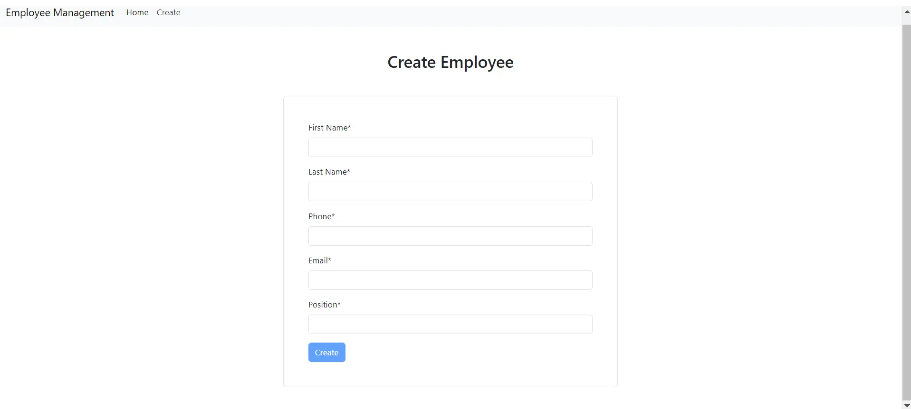
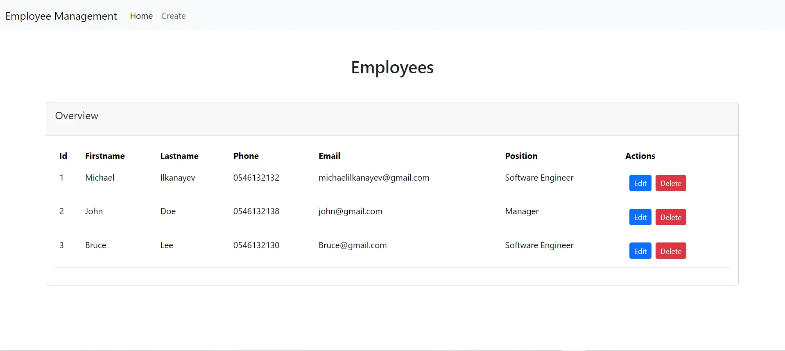
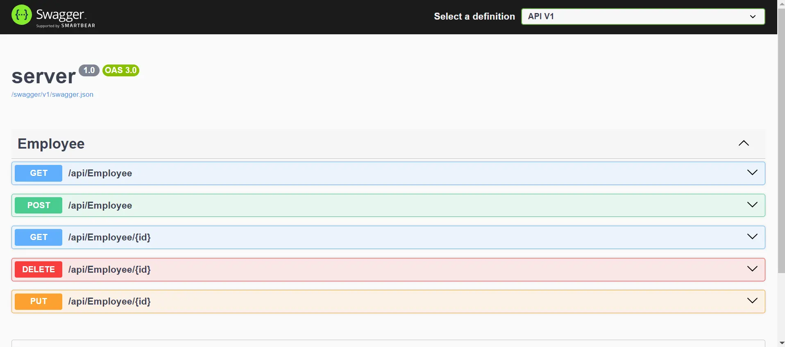

# Full Stack Project: Angular & ASP.NET

This project was mainly created to **learn ASP.NET**. It follows the **"Learn C# Full Stack Web Development with Angular and ASP.NET"** course by Jannick Leismann and Denis Panjuta.

## Overview

- **Backend**: ASP.NET 8 with C#
- **Frontend**: Angular 18
- **Database**: SQL Server using Entity Framework
- **API Testing**: Swagger

## Images

### Setup Instructions

1. **Clone the Repository**

   git clone https://github.com/michaelilkanayev1997/EmployeeManagement.git

3. **Backend Setup** (Visual Studio)
   
   - Open the `.sln` file in Visual Studio.
   - Restore NuGet packages using:
     
     dotnet restore
     
   - Run the backend using:

4. **Frontend Setup** (Visual Studio Code)

   - Navigate to the Angular project folder:
     
     cd client

   - Install the required dependencies:
     
     npm install

   - Run the Angular development server:
     
     ng serve or npm run start

